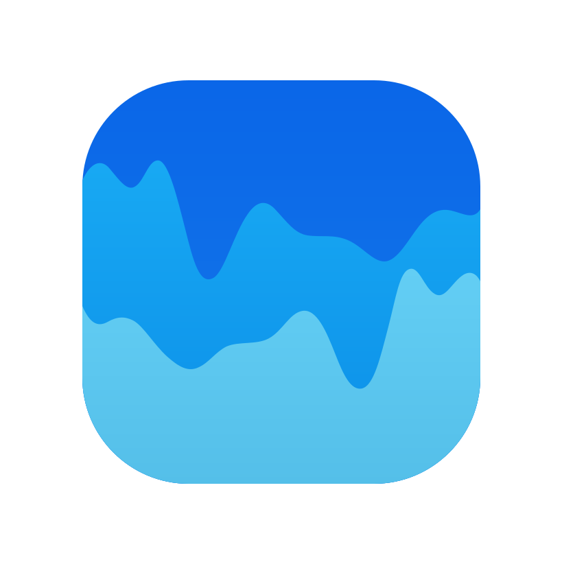

.. SPDX-License-Identifier: Apache-2.0

.. _gsoc-final-report:

==========================
Google Summer of Code 2026
==========================

.. rubric:: Metadata Tracking and Hyperparameter Visualization for Visdom
   :class: project-subtitle

Project Overview
----------------

Introduction
~~~~~~~~~~~~

`Visdom <https://github.com/fossasia/visdom>`_ is a visualization platform for
live, real-time and interactive machine-learning experiments. This Google
Summer of Code project focused on improving how Visdom organizes experiment
tags and visualizes hyperparameter optimization results.

The project, *Metadata Tracking and Hyperparameter Visualization for Visdom*,
was completed by `Zhengyang Peng <https://github.com/tonypzy>`_ with
`FOSSASIA <https://fossasia.org/>`_.

Project Goals and Outcomes
~~~~~~~~~~~~~~~~~~~~~~~~~~

The project had three main goals:

#. **Experiment tagging.** Add structured and validated tags for
   experiments across storage, server APIs, the Python SDK, live transports,
   and the browser. The completed system supports persistent tag updates, live
   synchronization, browser editing, and filtering.
#. **Optuna integration and visualization.** Connect Optuna studies with Visdom
   so that users can inspect individual trials and study-level results in one
   workflow. The completed integration records trials in deterministic
   environments and provides dashboards for both single- and multi-objective
   studies.
#. **Server state architecture.** Introduce a shared server-state layer to
   reduce coupling between handlers and centralize runtime state. The completed
   ``ServerState`` architecture is shared by HTTP, WebSocket, and polling
   handlers.

Project Scope
~~~~~~~~~~~~~

This report focuses on the three main deliverables above. It also covers
supporting work on environment isolation, WebSocket and polling behavior,
visualization APIs, frontend reliability, performance, documentation, and
Playwright-based testing.

:doc:`project-outcomes` describes the completed functionality and architecture,
while :doc:`pull-request-inventory` lists the merged pull requests associated
with the project.

Report Contents
---------------

.. toctree::
   :maxdepth: 2
   :caption: GSoC 2026

   Project Overview <self>
   project-outcomes
   pull-request-inventory
   future-improvements
   acknowledgements
