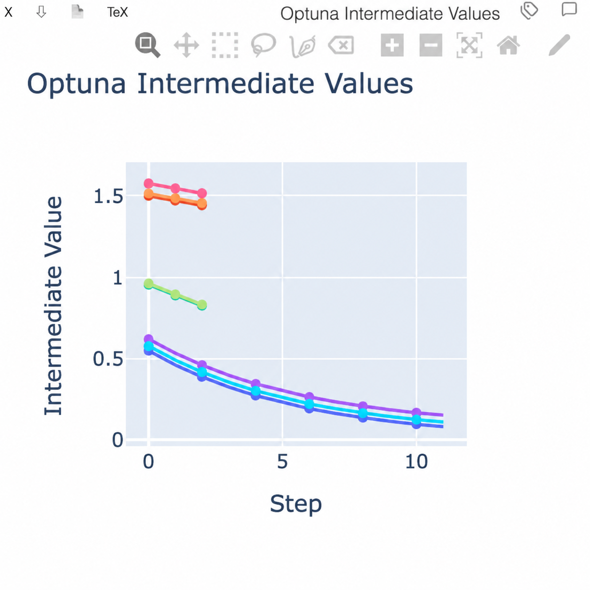
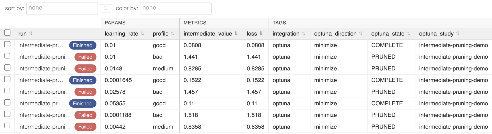

.. SPDX-License-Identifier: Apache-2.0

:tocdepth: 3

================
Project Outcomes
================

The project produced three main deliverables, together with several supporting
improvements to Visdom. The first deliverable adds
structured experiment tagging throughout Visdom. The second connects Optuna
trial execution to experiment environments and a study-level dashboard. The
third introduces a shared server-state architecture so request handlers no
longer depend directly on the Tornado application. All 50 pull requests listed
in the :doc:`pull-request-inventory` have been merged upstream.

Feature Demonstration: Tagging and Optuna Integration
-----------------------------------------------------

This demo presents the experiment-tagging workflow and the Optuna integration,
including study dashboards, multi-objective visualizations, trial timelines,
contour plots, and pruning results.

.. raw:: html

   <figure class="feature-demo-video">
     <video controls playsinline preload="metadata">
       <source src="_static/videos/gsoc-demo.mp4" type="video/mp4">
       Your browser does not support HTML5 video. You can
       <a href="_static/videos/gsoc-demo.mp4">download the demo video</a>
       instead.
     </video>
     <figcaption>
       Demonstration of experiment tagging and Optuna integration.
     </figcaption>
   </figure>

Deliverable 1: Experiment Tagging
----------------------------------------------

Problem
~~~~~~~

Visdom environments previously had no structured tags for organizing large
collections of experiments. Users could name environments, but they could not
attach validated tags, update them from Python, synchronize changes to open
browsers, or filter the environment list by tags.

Implementation
~~~~~~~~~~~~~~

The completed implementation is intentionally split across four layers. Each
layer builds on the existing ``ExperimentStore`` and environment-persistence
model instead of introducing a separate tag database:

.. code-block:: text

   ExperimentStore domain
          ↓
   authenticated HTTP API + transport update
          ↓
   typed Python SDK
          ↓
   browser editing, synchronization, and filtering

Store Domain
~~~~~~~~~~~~

`#1709 — Add environment tag store domain
<https://github.com/fossasia/visdom/pull/1709>`_ defines tag normalization,
validation limits, append/replace/clear semantics, and the
``ExperimentStore`` update operation. This keeps tag-update behavior
consistent between the backend and Python SDK.

Backend API and Transport
~~~~~~~~~~~~~~~~~~~~~~~~~

`#1712 — Add experiment tagging backend API and transport
<https://github.com/fossasia/visdom/pull/1712>`_ exposes authenticated tag
reads and writes, enforces read-only mode, persists valid changes, documents
the API, and broadcasts a transport-neutral ``tags_update`` message to browser
clients using either WebSocket or polling.

Python SDK
~~~~~~~~~~

`#1716 — Add experiment tagging Python SDK
<https://github.com/fossasia/visdom/pull/1716>`_ adds typed ``set_tags`` and
``get_tags`` operations. It also preserves validation-before-write, lazy
environment loading, persisted state, and live state overlays so that SDK and
browser views remain coherent.

Frontend Editing and Filtering
~~~~~~~~~~~~~~~~~~~~~~~~~~~~~~

`#1728 — Add experiment tagging frontend UI and filtering
<https://github.com/fossasia/visdom/pull/1728>`_ completes HTTP bootstrap,
incremental synchronization, tag display and editing, client-side validation,
cleanup after environment deletion, and tag-aware environment filtering.

.. list-table::
   :widths: 50 50
   :class: tagging-screenshot-grid

   * - .. figure:: _static/images/experiment-tag-editor.png
          :alt: Visdom dialog for editing key-value and key-only experiment tags
          :width: 100%

          Editing key/value and key-only tags for a Visdom environment.
     - .. figure:: _static/images/environment-tree-with-tags.png
          :alt: Visdom environment tree displaying tags next to environment names
          :width: 100%

          Tags displayed alongside environment names in the environment tree.

Deliverable 2: Optuna Integration and Hyperparameter Visualization
------------------------------------------------------------------

The completed Optuna integration covers trial-to-environment mapping, an
aggregate study dashboard, intermediate-value and pruned-trial trajectories,
multi-objective Pareto fronts, timelines that preserve short trials,
configurable contour visualizations, and shared dashboard trial selection
across callback instances.

Trial Integration and Data Capture
~~~~~~~~~~~~~~~~~~~~~~~~~~~~~~~~~~

`#1746 — Add Optuna experiment callback
<https://github.com/fossasia/visdom/pull/1746>`_ adds an optional
``OptunaCallback`` that maps each terminal trial to a deterministic Visdom
environment. It records trial parameters, objective values, state, study
identity, and experiment tags while keeping Optuna an optional dependency.

`#1757 — Visualize Optuna intermediate values and pruned trials
<https://github.com/fossasia/visdom/pull/1757>`_ preserves reported
intermediate values in training-step order and adds a dashboard pane for
completed and pruned trial trajectories.

   Intermediate values across completed and pruned trials.

Study Dashboard and Visualizations
~~~~~~~~~~~~~~~~~~~~~~~~~~~~~~~~~~

`#1753 — Add Optuna study dashboard
<https://github.com/fossasia/visdom/pull/1753>`_ builds the aggregate dashboard
used to inspect the study. It contains study metadata, HParams trial records,
optimization history, parameter importance, trial links, and a configurable
timeline and refresh cycle.

   Optuna trials in Visdom’s HParams view with parameters, metrics, tags, and
   states.

.. list-table::
   :widths: 50 50
   :class: optuna-screenshot-grid

   * - .. figure:: _static/images/optuna-history-accuracy.png
          :alt: Optimization history for accuracy across Optuna trials
          :width: 80%
          :align: center

          Optimization history for accuracy across trials.
     - .. figure:: _static/images/optuna-history-latency.png
          :alt: Optimization history for latency across Optuna trials
          :width: 80%
          :align: center

          Optimization history for latency across trials.
   * - .. figure:: _static/images/optuna-importance-accuracy.png
          :alt: Parameter importance for accuracy across Optuna hyperparameters
          :width: 80%
          :align: center

          Parameter importance for accuracy across hyperparameters.
     - .. figure:: _static/images/optuna-importance-latency.png
          :alt: Parameter importance for latency across Optuna hyperparameters
          :width: 80%
          :align: center
          :class: optuna-crop-top-5

          Parameter importance for latency across hyperparameters.

`#1767 — Add multi-objective Pareto front visualization
<https://github.com/fossasia/visdom/pull/1767>`_ extends objective metadata,
directions, and dashboard generation for multi-objective studies and adds a
Pareto-front view of non-dominated trials.

`#1776 — Keep short Optuna trials visible in the timeline
<https://github.com/fossasia/visdom/pull/1776>`_ gives zero-duration and very
short trials visible timeline markers without changing their recorded start
and completion timestamps.

.. list-table::
   :widths: 50 50
   :class: optuna-screenshot-grid

   * - .. figure:: _static/images/optuna-pareto-front.png
          :alt: Pareto front for accuracy and latency across Optuna trials
          :width: 80%
          :align: center

          Pareto front for accuracy and latency across trials.
     - .. figure:: _static/images/optuna-trial-timeline.png
          :alt: Timeline across completed Optuna trials
          :width: 80%
          :align: center

          Trial timeline across completed Optuna trials.

`#1782 — Add Optuna contour visualization
<https://github.com/fossasia/visdom/pull/1782>`_ adds configurable
two-parameter contour panes for each objective, completing the dashboard's
view of joint hyperparameter effects.

.. list-table::
   :widths: 50 50
   :class: optuna-screenshot-grid

   * - .. figure:: _static/images/optuna-contour-accuracy.png
          :alt: Contour of accuracy across depth and width
          :width: 80%
          :align: center

          Contour of accuracy across depth and width.
     - .. figure:: _static/images/optuna-contour-latency.png
          :alt: Contour of latency across depth and width
          :width: 80%
          :align: center

          Contour of latency across depth and width.

Dashboard Recovery and Shared Trial Selection
~~~~~~~~~~~~~~~~~~~~~~~~~~~~~~~~~~~~~~~~~~~~~

`#1778 — Fix dashboard trial selection across callbacks
<https://github.com/fossasia/visdom/pull/1778>`_ replaces callback-local trial
selection with stable experiment tags. A fresh callback or another worker can
therefore rediscover the same study trials and rebuild the shared dashboard.

Deliverable 3: Server State Architecture
----------------------------------------

Problem
~~~~~~~

Visdom handlers copied shared attributes from the Tornado ``Application``
during initialization. This tightly coupled handlers to the application's
internal structure and could leave long-lived socket handlers with stale
runtime values. The problem is documented in `Issue #1383
<https://github.com/fossasia/visdom/issues/1383>`_.

Architecture and Result
~~~~~~~~~~~~~~~~~~~~~~~

`#1384 — Introduce ServerState to decouple handlers from Application
<https://github.com/fossasia/visdom/pull/1384>`_ introduces a shared
``ServerState`` facade:

.. code-block:: text

   run_server.py
       │
       │ creates and starts
       │ 
       ▼
   Tornado HTTPServer ──────── uses ────────▶ Application
                                                  │
                                                  │
                       ┌──────────────────────────┴────────────────────────┐
                       │                                                   │
                       │                                                   │ 
                       │ creates                                           │registers routes and injects
                       │                                                   │ 
                       │                                                   │ 
                       ▼                                                   ▼
                  ServerState ◀── access through StateAccessorsMixin ─── Handlers
                                 

``Application`` now focuses on constructing the server and registering routes.
Each state-dependent handler receives the same ``ServerState`` instance.
``StateAccessorsMixin`` preserves familiar access such as ``self.state`` while
resolving it through the shared state instead of copying it during
initialization.

``ServerState`` centralizes environment state, subscriber and source
registries, configuration, saved layouts, dirty-environment tracking,
autosave coordination, and the polling connection monitor. Polling wrapper
construction remains in the handler layer, preventing the state layer from
depending on Tornado requests or concrete handlers.

Handlers no longer retain direct references to ``Application``. Compatibility
properties remain on ``Application`` for existing callers, allowing the
architecture to change without breaking established behavior. This makes the
shared server state easier to extend without coupling handlers directly to
``Application``.

Supporting Engineering Outcomes
-------------------------------

**Environment Correctness and Real-time Transport.** Environment identity now
remains consistent across server broadcasts and browser state by attaching
environment IDs to outgoing pane messages and rejecting stale
cross-environment messages (`#1267
<https://github.com/fossasia/visdom/pull/1267>`_). Callback registration is
scoped by environment and target (`#1279
<https://github.com/fossasia/visdom/pull/1279>`_), environment-specific state
can be retrieved through the server and Python client (`#1318
<https://github.com/fossasia/visdom/pull/1318>`_), and direct append updates
create missing environments before writing (`#1373
<https://github.com/fossasia/visdom/pull/1373>`_). WebSocket and polling now use
the same incoming-message handling path (`#1643
<https://github.com/fossasia/visdom/pull/1643>`_).

**Backend Architecture, Authentication, and Lifecycle.** Handler authorization
is less repetitive because authentication checks use a shared ``BaseHandler``
helper (`#1627 <https://github.com/fossasia/visdom/pull/1627>`_). The server can
start with ``env_path=None`` and operate without disk-backed environment
storage (`#1556 <https://github.com/fossasia/visdom/pull/1556>`_), while the
legacy ``send=False`` path and stale index-page code have been removed (`#1666
<https://github.com/fossasia/visdom/pull/1666>`_).

**Visualization APIs and Interactive Features.** The public visualization
surface now includes normalized arbitrary scatter labels (`#1277
<https://github.com/fossasia/visdom/pull/1277>`_), programmatic image-history
selection with corrected selected-image updates (`#1335
<https://github.com/fossasia/visdom/pull/1335>`_), Histogram2D (`#1428
<https://github.com/fossasia/visdom/pull/1428>`_), Sankey diagrams (`#1457
<https://github.com/fossasia/visdom/pull/1457>`_), and named Learning Curve
plots (`#1568 <https://github.com/fossasia/visdom/pull/1568>`_). Embeddings
gained upgraded D3 interaction packages and adapted lasso handling (`#1276
<https://github.com/fossasia/visdom/pull/1276>`_), reliable first-attempt lasso
drill-down, focus, and asynchronous point rendering (`#1471
<https://github.com/fossasia/visdom/pull/1471>`_), visible closure and
minimum-selection guidance (`#1475
<https://github.com/fossasia/visdom/pull/1475>`_), and an option to disable the
default Python event-handler registration (`#1585
<https://github.com/fossasia/visdom/pull/1585>`_).

.. list-table::
   :widths: 50 50
   :class: supporting-screenshot-grid

   * - .. figure:: _static/images/histogram2d-gaussian-blob.png
          :alt: Two-dimensional histogram of a Gaussian blob
          :width: 80%
          :align: center

          2D histogram of a Gaussian blob.
     - .. figure:: _static/images/histogram2d-correlated-probability.png
          :alt: Two-dimensional probability histogram of correlated data
          :width: 80%
          :align: center

          2D probability histogram of correlated data.
   * - .. figure:: _static/images/sankey-moe-routing.png
          :alt: Sankey diagram of mixture-of-experts routing
          :width: 70%
          :align: center

          MoE routing across experts and output.
     - .. figure:: _static/images/sankey-pipeline-flow.png
          :alt: Sankey diagram of a preprocessing and dataset-split pipeline
          :width: 70%
          :align: center

          Pipeline flow across preprocessing and dataset splits.

**Frontend UX and Environment Management.** Routine browser use was improved
across several areas: pane property fields accept keyboard input (`#1265
<https://github.com/fossasia/visdom/pull/1265>`_), text panes support selection
and clipboard copying (`#1312
<https://github.com/fossasia/visdom/pull/1312>`_), and the properties overlay
has an opaque, readable background (`#1294
<https://github.com/fossasia/visdom/pull/1294>`_). Environment search accepts
user input again (`#1547 <https://github.com/fossasia/visdom/pull/1547>`_),
malformed saved layout data is recovered with user notifications (`#1560
<https://github.com/fossasia/visdom/pull/1560>`_), and pane relayout uses
deterministic ordering and consistent state updates (`#1678
<https://github.com/fossasia/visdom/pull/1678>`_). Large environment collections
can also be filtered, selected, and deleted in batches while preserving valid
selections and recovering from deletion of the active environment (`#1791
<https://github.com/fossasia/visdom/pull/1791>`_).

**Performance Optimization.** Generic pane updates use a shallow top-level copy
and limit deep copying to nested mutable content (`#1297
<https://github.com/fossasia/visdom/pull/1297>`_). Embeddings updates use a
dedicated path with manually constructed JSON Patch operations, bypassing the
generic ``deepcopy``, ``make_patch``, and serialization flow (`#1372
<https://github.com/fossasia/visdom/pull/1372>`_). Together, these changes reduce
unnecessary copying, diff generation, and serialization while preserving
update semantics.

**Testing and CI Modernization.** Visual regression tooling was adapted to
Pixelmatch 7 (`#1437 <https://github.com/fossasia/visdom/pull/1437>`_),
pane-interaction coverage was ported to Playwright (`#1597
<https://github.com/fossasia/visdom/pull/1597>`_), and readiness-aware
Playwright screenshot baseline generation was added (`#1607
<https://github.com/fossasia/visdom/pull/1607>`_). Playwright visual comparison
and CI artifact flows followed (`#1615
<https://github.com/fossasia/visdom/pull/1615>`_), while separate WebSocket and
polling configurations verify which transport is actually active (`#1622
<https://github.com/fossasia/visdom/pull/1622>`_). Playwright then became the
default E2E and visual test system across commands, CI, and documentation
(`#1691 <https://github.com/fossasia/visdom/pull/1691>`_) before the retired
Cypress tests, configuration, and dependencies were removed (`#1705
<https://github.com/fossasia/visdom/pull/1705>`_).

**Documentation and Maintenance.** The README plotting documentation and API
index were synchronized with the implemented APIs (`#1494
<https://github.com/fossasia/visdom/pull/1494>`_), runnable Sunburst and general
``plotlyplot`` examples were added (`#1514
<https://github.com/fossasia/visdom/pull/1514>`_), and a stale SID-generation
comment was removed from the socket handler (`#1521
<https://github.com/fossasia/visdom/pull/1521>`_).
